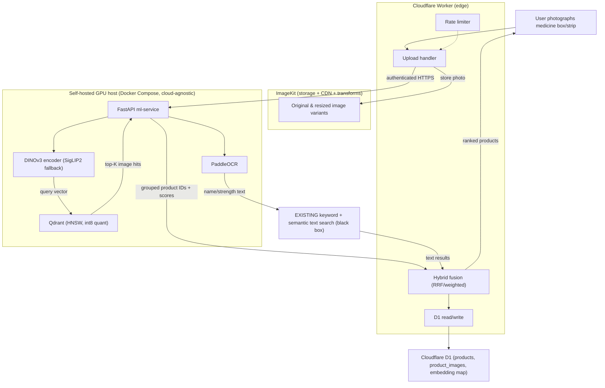

# Visual Image Search — Detailed Implementation Plan

## Summary
Add an **image-to-image** visual search pipeline to an existing pharmacy e-commerce catalog (~80k products, ~320k images) and fuse its results with the **existing** keyword + semantic text search via a hybrid ranker. This is **additive**: the existing text search is treated as a black-box service we call and merge from — it is not redesigned. The ML tier is a self-hosted, cloud-agnostic Docker stack (FastAPI + Qdrant) running DINOv3 embeddings on a modest GPU; a Cloudflare Worker fronts uploads (ImageKit), catalog metadata (D1), and calls the GPU service over an authenticated HTTPS endpoint. All secrets are referenced by env-var name only; never write literal secret values into any file.

## Confirmed stack (do not re-decide)
- **Image encoder:** DINOv3 (`facebook/dinov3-vitb16-pretrain-lvd1689m`) via HuggingFace Transformers ≥ 4.56.0, gated access. Encoder-agnostic config (embedding dim configurable). Documented fallback: **SigLIP 2** (Apache-2.0, via OpenCLIP/HF).
- **OCR:** PaddleOCR 3.x (`PaddleOCR().predict(...)`, PP-OCRv5). Output feeds the **existing** keyword search.
- **Vector DB:** Qdrant self-hosted, HNSW, cosine distance, int8 scalar quantization (production default). Universal Query API + RRF available for hybrid, but the primary image query is a single dense-vector ANN search.
- **API:** FastAPI on the GPU box — `/embed` and `/search`.
- **Edge:** Cloudflare Worker — upload→ImageKit, read/write D1, auth to GPU service, response shaping, rate limiting.
- **Storage/CDN:** ImageKit (originals + transforms). **Catalog metadata:** Cloudflare D1.
- **Hardware:** one L4/T4/g6-class GPU; full re-index in a few hours; per-query = single embed + ANN (single-digit to tens of ms).

## Architecture



## File structure map

```
image-search/
├── ml-service/                       # FastAPI GPU service (Python)
│   ├── app/
│   │   ├── main.py                   # FastAPI app, /embed /search /ocr /healthz
│   │   ├── config.py                 # Pydantic settings; env-var-driven (encoder, dim, Qdrant URL, auth secret)
│   │   ├── encoders/
│   │   │   ├── base.py               # Encoder protocol: embed(images)->np.ndarray, dim property
│   │   │   ├── dinov3.py             # DINOv3 loader + preprocessing + GPU batching
│   │   │   └── siglip2.py            # SigLIP2 fallback (OpenCLIP/HF)
│   │   ├── ocr/paddle.py             # PaddleOCR wrapper: extract_name_strength(image)
│   │   ├── search/
│   │   │   ├── qdrant_client.py      # collection create/config, upsert, ANN query
│   │   │   ├── grouping.py           # group image hits by product_id (max/mean pool)
│   │   │   └── threshold.py          # confidence thresholding + fallback signal
│   │   └── auth.py                   # shared-secret verification for Worker->service
│   ├── scripts/
│   │   ├── backfill_index.py         # idempotent, resumable indexing of 320k images
│   │   └── build_eval_set.py         # helper to assemble labeled eval set
│   ├── tests/                        # pytest
│   ├── requirements.txt
│   └── Dockerfile                    # CUDA base, transformers>=4.56, paddleocr, qdrant-client
├── worker/                           # Cloudflare Worker (TypeScript)
│   ├── src/
│   │   ├── index.ts                  # router
│   │   ├── upload.ts                 # ImageKit upload (private key via env)
│   │   ├── d1.ts                     # D1 queries (products, images, mapping)
│   │   ├── ml_client.ts             # authenticated fetch to GPU service
│   │   ├── fusion.ts                 # RRF/weighted merge of image + text results
│   │   ├── ratelimit.ts              # per-IP/token rate limiting
│   │   └── text_search_adapter.ts    # adapter to EXISTING keyword+semantic search
│   ├── wrangler.toml                 # D1 binding, vars (secret names only)
│   ├── test/                         # vitest + @cloudflare/vitest-pool-workers
│   └── package.json
├── infra/
│   ├── docker-compose.yml            # qdrant + ml-service (GPU), volumes, healthchecks
│   └── qdrant-config.yaml            # storage/HNSW/quantization defaults
├── db/
│   ├── migrations/0001_init.sql      # D1 schema
│   └── seed_dev.sql                  # tiny dev fixture
├── eval/
│   ├── dataset/                      # labeled photo->product pairs
│   └── run_eval.py                   # recall@k, top-1, latency, freshness
├── docs/
│   ├── cost-model.md                 # open-source vs managed Vertex
│   ├── license-review-dinov3.md      # gating deliverable
│   └── runbook.md                    # index/re-embed/rollback ops
└── README.md
```

## Tasks

### Task 0 — DINOv3 license review + gated-access request [parallel] (GATING, non-code)
Real blocker for commercial deployment. Deliverable `docs/license-review-dinov3.md`:
- Submit HuggingFace gated-access request for `facebook/dinov3-*` (approval takes up to a few days — start immediately).
- Legal review of Meta AI custom license + acceptable-use policy (commercial use permitted; excludes comprehensively sanctioned jurisdictions).
- Decision record: proceed with DINOv3, or activate SigLIP 2 (Apache-2.0) fallback. All embedding-dependent tasks are encoder-agnostic, so either outcome keeps the pipeline buildable.
- **Verification:** doc reviewed/signed off by legal; HF access approved (token can pull weights) OR fallback decision recorded. Task 3 must not deploy DINOv3 weights to production before this clears.

### Task 1 — Repo scaffold + infra Docker Compose [parallel]
Create the directory tree above with stub modules and configs.
- `infra/docker-compose.yml`: `qdrant` service (persistent volume, ports 6333/6334, healthcheck) + `ml-service` (GPU runtime `deploy.resources.reservations.devices` / `--gpus all`, depends_on qdrant healthy, env from `.env` referencing secret names only).
- `ml-service/Dockerfile`: CUDA runtime base, `pip install` from `requirements.txt` (torch, transformers>=4.56.0, qdrant-client, paddleocr, paddlepaddle-gpu, fastapi, uvicorn, pillow, numpy, pydantic-settings).
- `worker/wrangler.toml`: D1 binding, `vars`/secrets by name only (`IMAGEKIT_PUBLIC_KEY`, `IMAGEKIT_PRIVATE_KEY`, `CF_ACCOUNT_ID`, `CF_D1_DATABASE_ID`, `CF_D1_API_TOKEN`, `ML_SERVICE_URL`, `ML_SERVICE_SHARED_SECRET`).
- `ml-service/app/config.py`: Pydantic settings — `ENCODER` (dinov3|siglip2), `EMBEDDING_DIM`, `QDRANT_URL`, `QDRANT_COLLECTION`, `ML_SERVICE_SHARED_SECRET`, batch size, device.
- **Verification:** `docker compose -f infra/docker-compose.yml config` validates; `docker compose up qdrant` reaches healthy; `GET /healthz` returns 200 from a stub FastAPI; `wrangler deploy --dry-run` in `worker/` succeeds.

### Task 2 — Data model: D1 schema + Qdrant collection config [after 1]
- `db/migrations/0001_init.sql`:
  - `products(product_id PK, sku, name, manufacturer, strength, barcode, active, updated_at)`
  - `product_images(image_id PK, product_id FK, imagekit_file_id, imagekit_url, is_reference, created_at)`
  - `embedding_map(vector_id PK, image_id FK, product_id, encoder, embedding_dim, indexed_at)` — maps Qdrant point IDs to catalog rows; `encoder`/`embedding_dim` recorded so re-embeds under a different encoder are tracked.
  - Indexes on `product_images.product_id`, `embedding_map.product_id`, `products.barcode`.
- `ml-service/app/search/qdrant_client.py` `ensure_collection()`: vector `size=EMBEDDING_DIM`, `distance=COSINE`, HNSW (`m=16`, `ef_construct=128`), `ScalarQuantization(type=INT8, always_ram=True)`, payload schema `{product_id, image_id, encoder, is_reference}`. Named-vector support kept for future hybrid (single dense vector `"image"` for now).
- **Verification:** `wrangler d1 execute --local --file db/migrations/0001_init.sql` succeeds; pytest creates a collection against an ephemeral Qdrant and asserts `get_collection()` returns expected dim/distance/quantization; upsert+query a dummy vector returns it.

### Task 3 — Embedding service: encoder + /embed [after 1, after 2] (gated by Task 0 for prod weights)
- `encoders/base.py`: `Encoder` protocol — `embed(images: list[PIL.Image]) -> np.ndarray[float32]`, `dim: int`, L2-normalize outputs (cosine-ready).
- `encoders/dinov3.py`: `AutoImageProcessor`/`AutoModel.from_pretrained(model_id)`, `torch.inference_mode()`, use `pooler_output` (or mean of last_hidden_state per DINOv3 guidance), GPU batching (config batch size), fp16 on GPU.
- `encoders/siglip2.py`: same protocol via OpenCLIP/HF SigLIP2 image tower; selected when `ENCODER=siglip2`.
- `app/main.py` `POST /embed`: accepts image bytes/URL(s) → returns normalized vector(s) + dim + encoder id. Auth via `app/auth.py` shared-secret header.
- **Verification:** unit test with a small fixture image asserts output shape `== EMBEDDING_DIM`, L2 norm ≈ 1.0, deterministic across two calls; identical image → cosine ≈ 1.0, clearly different image → lower score; `/embed` returns 401 without the shared secret; batching test with N images returns N vectors. Encoder swap test: switching `ENCODER` env changes reported dim without code change.

### Task 4 — Backfill / indexing pipeline [after 3]
`ml-service/scripts/backfill_index.py`:
- Iterate `product_images` from D1 (paginated), fetch each image from its ImageKit URL (request a resized transform variant, e.g. 512px, to cut bandwidth), embed in GPU batches, upsert to Qdrant with payload, write/update `embedding_map` in D1.
- **Idempotent + resumable:** skip image_ids already in `embedding_map` for the current `encoder`; checkpoint file / cursor; safe re-run.
- Progress logging (rate, ETA), retry with backoff on transient ImageKit/D1 errors.
- Emit throughput + cost estimate at end (images/sec, GPU-hours).
- **Verification:** dry-run on 100-image dev fixture indexes all, second run indexes 0 (idempotent); killing mid-run and resuming reaches full count with no duplicate vector_ids; Qdrant count == indexed count; spot-check a known image's nearest neighbor is itself.

### Task 5 — OCR pipeline [after 3] [parallel with 4]
`ml-service/app/ocr/paddle.py`:
- `PaddleOCR(lang="en", use_textline_orientation=True)`, `.predict(image)` (3.x API), collect `text`/`confidence`/`bbox`.
- `extract_name_strength()`: heuristics to pull candidate product name + strength token (e.g. regex for `\d+\s?(mg|ml|mcg|g|iu)`), rank lines by font/box size + confidence.
- `POST /ocr` returns candidate query string(s) + raw tokens. Worker forwards these to the **existing keyword search** (via `text_search_adapter`), not a new search.
- **Verification:** unit test on sample medicine-box images asserts expected name+strength extracted (e.g. "Crocin", "650"); low-confidence/no-text image returns empty candidates gracefully; latency logged.

### Task 6 — Query/search service: image → product IDs [after 3, after 2]
- `search/qdrant_client.py` `query()`: single dense ANN, top-K (config, default e.g. 200 image hits), `search_params` with `quantization.rescore=True` for accuracy.
- `search/grouping.py`: group image hits by `product_id`, pool multiple image hits per product (max or mean, configurable), produce ranked product list with scores.
- `search/threshold.py`: confidence thresholding — if top product score < threshold, flag `weak_visual_match=True` so the edge can fall back to text search.
- `app/main.py` `POST /search`: image → embed → ANN → group → threshold → `{products:[{product_id, score}], weak_visual_match}`.
- **Verification:** integration test against seeded Qdrant: query with a product's own image returns that product_id rank 1; product with 4 images dedupes to a single result; threshold flag set when querying an out-of-catalog image; end-to-end `/search` latency measured (< target tens of ms on GPU for ANN portion).

### Task 7 — Hybrid fusion + existing-search adapter [after 6] [parallel with 8 stub]
- `worker/src/text_search_adapter.ts`: adapter interface `search(query|ocrText) -> [{product_id, score, rank}]` wrapping the **existing** keyword + semantic search endpoint (black box). Isolates the integration behind one interface.
- `worker/src/fusion.ts`: merge image-search product list with text results via **RRF** (default) and optional weighted fusion; tunable weights via env/config (`W_IMAGE`, `W_TEXT`, `RRF_K`). When `weak_visual_match`, down-weight image contribution / lean on text.
- **Verification:** unit tests: RRF of two known ranked lists produces expected fused order; weight of 0 for text yields image-only order and vice versa; adapter mocked so fusion is testable without the live text service; weak-match path prefers text results.

### Task 8 — Cloudflare Worker edge [after 1, after 2] (integrates 6/7 as they land)
- `worker/src/upload.ts`: receive user photo, upload to ImageKit upload API (`Authorization: Basic base64(IMAGEKIT_PRIVATE_KEY)`), get file_id/URL. Never expose private key client-side.
- `worker/src/ml_client.ts`: authenticated HTTPS to GPU service (shared-secret header; document Cloudflare Tunnel / mTLS option as the transport hardening choice). Calls `/embed`+`/search` and `/ocr`.
- `worker/src/d1.ts`: read product metadata by product_id for response shaping (name, manufacturer, ImageKit URL, price).
- `worker/src/index.ts`: orchestrate upload → `/search` (image) + `/ocr`→text-adapter (parallel) → `fusion` → D1 hydrate → shaped JSON response.
- `worker/src/ratelimit.ts`: per-IP/token rate limiting (Workers rate-limiting binding or KV counter).
- **Verification:** vitest with `@cloudflare/vitest-pool-workers`: upload mocked ImageKit returns file id; `/search` path returns shaped products; rate limiter blocks over-limit; missing/invalid shared secret to ml_client fails closed; D1 hydrate joins metadata correctly.

### Task 9 — Pharmacy-specific robustness [after 6, after 5, after 7]
- **Packaging redesigns:** support multiple reference images per product (`product_images.is_reference`); `docs/runbook.md` documents periodic re-embed job (reuse `backfill_index.py` filtered to changed products).
- **Near-identical generics:** tie-breakers combining OCR name/strength + `manufacturer` + `barcode` (D1 fields) applied in `fusion.ts` when top visual scores are within a small delta.
- **Bad user photos:** preprocessing in encoder path — resize/normalize (already), optional center-crop / simple pack-region detect; request ImageKit auto-orient/resize transform on upload.
- **Confidence thresholding + fallback:** wire `threshold.py` flag through fusion so weak visual matches fall back to text search.
- **Verification:** test set of blurry/tilted/low-light photos still returns correct product in top-K; two near-identical generics disambiguated when OCR/barcode present; redesigned-pack product with old+new reference images matches both; forced weak-match falls back to text results.

### Task 10 — Observability + eval harness [after 6, after 7]
`eval/run_eval.py` + `eval/dataset/`:
- Labeled eval set of photo→product pairs (`build_eval_set.py` helper); metrics: **recall@k**, **top-1** for photo→product, per-stage latency (embed, ANN, fusion, end-to-end), index freshness (max `indexed_at` vs product update).
- Structured logging/metrics counters in FastAPI (`/metrics` or logs): query latency histograms, weak-match rate.
- A/B harness: compare fused image+text vs current text-only on the eval set.
- **Verification:** `python eval/run_eval.py --dataset eval/dataset` prints recall@1/5/10, top-1, latency percentiles; A/B report shows fused vs text-only deltas; CI-runnable on the small dev fixture.

### Task 11 — Cost model doc [parallel]
`docs/cost-model.md`:
- **Open-source (chosen):** one-time GPU indexing hours (estimate images/sec × 320k) + storage (~160–320 GB originals+variants on ImageKit) + Qdrant VM (RAM sized for 320k × dim × int8) + ImageKit + D1.
- **Managed alternative:** Vertex embeddings ~$0.0001/image ≈ ~$32 to embed 320k once, plus recurring per-query and re-embed costs; contrast recurring vs one-time.
- Make the open-source-vs-managed tradeoff explicit (no per-image fees, no vendor lock-in vs. ops burden of self-hosting GPU + Qdrant).
- **Verification:** doc reviewed; numbers cross-checked against Task 4 measured throughput and Qdrant memory sizing.

### Task 12 — Rollout / phasing doc + feature flag [after 8, after 10]
`docs/runbook.md` phasing + Worker feature flag:
- **Phase 1 (MVP):** single encoder, image-only search behind a flag; no fusion.
- **Phase 2:** hybrid fusion (Task 7) enabled.
- **Phase 3 (hardening):** int8 quantization tuning, OCR/barcode tie-breakers, eval loop + re-embed cadence.
- Feature flag in `worker/wrangler.toml` vars (`IMAGE_SEARCH_ENABLED`, `HYBRID_FUSION_ENABLED`).
- **Verification:** toggling flags off returns pure text-search behavior (proves additive/non-breaking); phased enablement documented with rollback steps.

## Ordering rationale
- **Task 0** runs immediately in parallel (external approval latency) and gates only production DINOv3 weight deployment; the encoder-agnostic design keeps all other work unblocked (SigLIP2 usable meanwhile).
- **1 → 2** establish scaffold, then schema/collection (contracts everything else depends on).
- **3** (embedding) is the core dependency for **4, 5, 6**.
- **4** (backfill) and **5** (OCR) are independent of each other → parallel after 3.
- **6** (search) needs embedding + collection; **7** (fusion) needs 6's grouped output shape.
- **8** (Worker) can scaffold after 1/2 and integrate 6/7 as they land.
- **9, 10** layer robustness + eval on top of the working search+fusion.
- **11** is standalone; **12** closes with rollout after edge + eval exist.

## Testing (integration)
Final end-to-end: `docker compose up` (qdrant + ml-service) with SigLIP2 (unblocked) → run `backfill_index.py` on dev fixture → `wrangler dev` Worker → POST a sample medicine photo → assert shaped response ranks the correct product #1, OCR candidates present, fusion applied, latency within target, and flags-off yields text-only behavior. Swap `ENCODER=dinov3` once Task 0 clears and re-run eval to confirm recall@k parity/gain.
