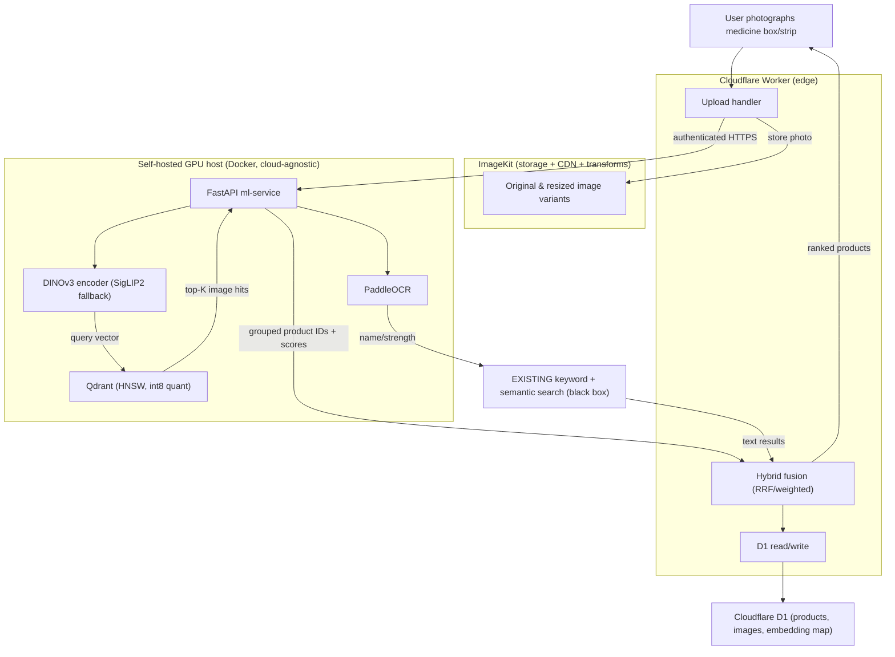

# Visual Image Search for the Pharmacy Catalog — Summary

## Problem & goal
You have ~80,000 products with ~4 images each (~320,000 images) and working **keyword + semantic text search**. You want to add **"search by photo"**: a user photographs a medicine box/strip and gets the matching product. At this scale this is a small dataset for modern vector search, so the right framing is **visual similarity search**, not "Google Image Search."

This plan is **additive**. Your existing text search is treated as a black box we call and merge results from — it is **not** redesigned or rebuilt.

## Key decisions (confirmed with you)
- **Self-hosted open-source**, not managed cloud APIs — no per-image fees after indexing, no vendor lock-in. (Google Cloud Vision is an OCR/labeling product, not a product-similarity engine, so it is not the core here.)
- **Primary image encoder: DINOv3** (Meta). For *pure image-to-image* matching — exactly the "photo of a box → find product" case — DINOv3 is state-of-the-art, substantially beating CLIP/SigLIP on visual-similarity benchmarks. **SigLIP 2** (Apache-2.0) is a documented drop-in fallback; the pipeline is encoder-agnostic so swapping costs little.
- **PaddleOCR** reads the pack text (e.g. "Crocin 650") and feeds it into your **existing** keyword search — it does not create a second search engine.
- **Qdrant** (self-hosted) as the vector DB: HNSW index, cosine distance, int8 scalar quantization (~4× less memory, <1% recall loss).
- **FastAPI** ML service on one modest GPU (L4/T4-class); full re-index runs in a few hours, each query is a single embedding + nearest-neighbor lookup (tens of ms).
- **Your infra:** **ImageKit** for image storage + CDN/transforms, **Cloudflare D1** for catalog metadata, and a **Cloudflare Worker** as the public edge that handles uploads, reads D1, and calls the GPU service over an authenticated endpoint. The ML tier itself is cloud-agnostic Docker so it can run on any GPU VM.

> Security note: the Cloudflare and ImageKit credentials pasted in chat should be **rotated** and supplied via Settings → Secrets / server env. The plan references all secrets by env-var name only and never writes literal values to any file.

## Why this shape
Cloudflare Workers can't run self-hosted GPU models, so the system splits into two tiers: a **GPU ML tier** (DINOv3 + PaddleOCR + Qdrant behind FastAPI) and a **Cloudflare edge tier** (Worker + D1 + ImageKit). Vectors — not pixels — are what gets searched; originals live in ImageKit, the product↔image↔vector mapping lives in D1, and the embeddings live in Qdrant.

## Architecture

## Difficulties this plan explicitly handles
- **Packaging redesigns** — multiple reference images per product + a periodic re-embed job.
- **Near-identical generics** — OCR name/strength + manufacturer + barcode tie-breakers when visual scores are close.
- **Bad user photos** (blur/tilt/low light) — resize/normalize + ImageKit auto-orient, and a **confidence threshold that falls back to text search** when there's no strong visual match.

## Cost picture
- **Open-source (chosen):** a one-time GPU indexing run (a few hours) + storage (~160–320 GB) + a Qdrant VM + ImageKit + D1. No per-image fees beyond embedding the user's uploaded photo.
- **Managed alternative (for contrast):** Vertex multimodal embeddings ≈ $0.0001/image ≈ ~$32 to embed 320k once, plus recurring per-query/re-embed costs and vendor lock-in.
- At 320k images, self-hosting is meaningfully cheaper over time; the plan includes a `docs/cost-model.md` with numbers cross-checked against measured throughput.

## Approach to execution
13 tasks (a gating **Task 0** license review + 12 build tasks) marked `[parallel]`/`[after N]`. A `Task 0` DINOv3 license + gated-access review runs from day one (approval can take days) and gates only production DINOv3 weights — everything else builds on SigLIP 2 meanwhile. Rollout is phased behind feature flags: MVP image-only search → hybrid fusion → hardening (quantization tuning, tie-breakers, eval loop). See `v1-image-search.md` for the full task breakdown, file paths, and per-task tests.

## Scope boundary / handoff
This plan delivers a **JSON API + Worker response shaping**. A customer-facing "search by photo" **UI** (camera capture, results grid, fallback messaging) is a separate frontend plan and is not included here.
