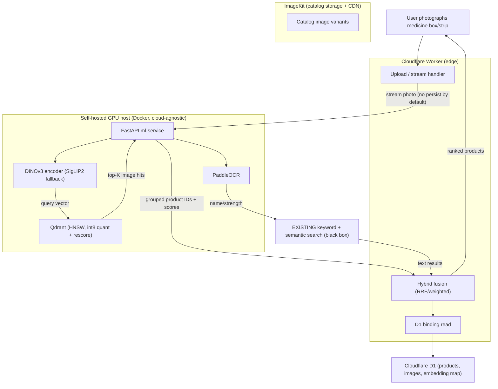

# Visual Image Search for the Pharmacy Catalog — Summary (v2)

## Overview
You have ~80,000 products with ~4 images each (~320,000 images) and working **keyword + semantic text search**. You want to add **"search by photo"**: a user photographs a medicine box/strip and gets the matching product. At this scale this is a small dataset for modern vector search, so the right framing is **visual similarity search** (search vectors, not pixels), not "Google Image Search."

This work is **additive**. Your existing text search is treated as a black box we call and merge results from — it is **not** redesigned or rebuilt. Google Cloud Vision is an OCR/labeling product, not a product-similarity engine, so it is not the core here (it's covered as an alternative in a provider comparison doc).

> **Security note:** the Cloudflare and ImageKit credentials pasted in chat should be **rotated** and supplied via Settings → Secrets / server env. All secrets in this plan are referenced by env-var name only; no literal values are written to any file.

## Current Architecture
- **Catalog & commerce:** existing product catalog with SKUs, manufacturers, and pricing served by an existing commerce API.
- **Search today:** working keyword + semantic text search (the black box we integrate with).
- **Your infra accounts:** ImageKit (image storage + CDN + transforms) and Cloudflare (D1 database + Workers) — inferred from the credentials you provided.
- **No image/visual search exists yet** — that is the gap this plan fills.

## Proposed Changes
The system splits into two tiers because Cloudflare Workers cannot run self-hosted GPU models:

- **GPU ML tier (self-hosted, cloud-agnostic Docker):** a FastAPI service running the **DINOv3** image encoder (with **SigLIP 2** as an Apache-2.0 fallback), **PaddleOCR** for reading pack text, and **Qdrant** as the vector database (HNSW index, cosine distance, int8 scalar quantization with rescore). It exposes image-search and OCR endpoints and runs the one-time indexing/backfill of all 320k catalog images.
- **Cloudflare edge tier:** a Worker that receives the user's photo, calls the ML tier for image search and OCR, forwards OCR text to your existing keyword search, **fuses** the image and text result lists (Reciprocal Rank Fusion), reads product metadata from D1, hydrates price from your commerce API, and returns a ranked product list. It also handles auth to the GPU service, rate limiting, and feature flags.

Domain-specific handling is built in: multiple reference images per product (packaging redesigns), OCR + manufacturer + barcode tie-breakers for near-identical generics, preprocessing for blurry/tilted/low-light photos, and a confidence threshold that falls back to text search when there's no strong visual match. A labeled evaluation harness measures recall@k / top-1 / latency and calibrates the confidence thresholds. A gating **DINOv3 license review** runs from day one and blocks only production DINOv3 weights — all build work proceeds on SigLIP 2 meanwhile.

## Key Design Decisions
- **Self-hosted open-source over managed APIs** — no per-image fees after indexing, no vendor lock-in. A provider-alternatives doc contrasts Google Cloud Vision, Vertex multimodal embeddings, other vector DBs (Milvus/pgvector/FAISS), and GPU hosting options so the trade-off is explicit.
- **DINOv3 as primary encoder** — for *pure image-to-image* matching (exactly "photo of a box → find product"), DINOv3 is state-of-the-art, substantially beating CLIP/SigLIP on visual-similarity benchmarks. It is gated under a custom Meta license, so a legal/access review (Task 0) gates production use; **SigLIP 2** (Apache-2.0) is a drop-in fallback and the launch encoder. The pipeline is encoder-agnostic, with a **separate Qdrant collection per encoder** so both can coexist and swapping is a config flip after re-indexing.
- **Query photos are streamed, not stored by default** — pharmacy photos can contain PII; persistence to ImageKit is opt-in behind a flag with retention/consent rules.
- **Hybrid fusion via RRF** — image results and your existing text results are merged by rank, with tunable weights and a weak-visual-match fallback to text.
- **Cost:** self-hosting means a one-time GPU indexing run (a few hours) plus storage (~160–320 GB), a Qdrant VM, ImageKit, and D1 — no per-image fees beyond embedding the user's uploaded photo. The managed contrast (Vertex ≈ $32 to embed 320k once, plus recurring) is documented; at this scale self-hosting is **expected to be cheaper over time under projected traffic — validated in the cost model** (it depends on GPU VM utilization and operational cost). The cost model accounts for quantized RAM, retained float vectors for rescoring, HNSW graph, and payload overhead — not just the quantized vectors.
- **Phased rollout behind feature flags** — MVP image-only search → hybrid fusion → hardening (DINOv3 swap, quantization tuning, tie-breakers, eval loop) — so the addition is non-breaking and reversible.

## Scope boundary / handoff
This plan delivers a **JSON API + Worker response shaping**. A customer-facing "search by photo" **UI** (camera capture, results grid, fallback messaging) is a separate frontend plan and is not included here.
