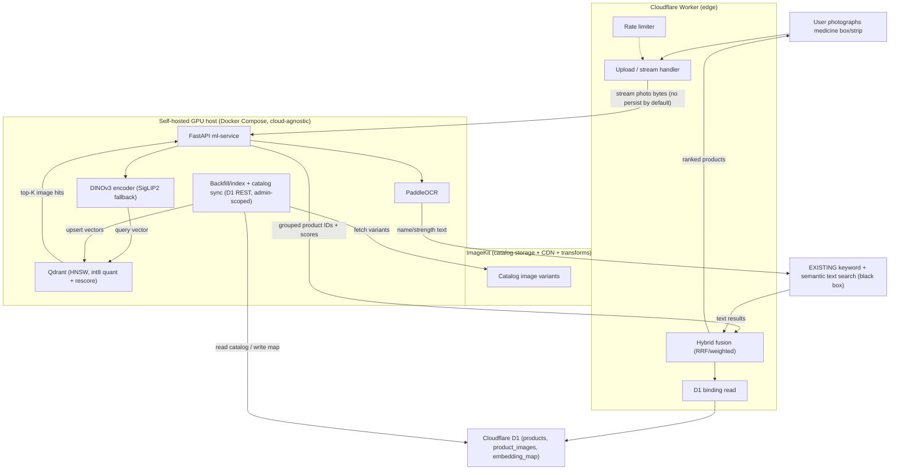

# Visual Image Search — Detailed Implementation Plan (v2)

## Summary
Add an **image-to-image** visual search pipeline to an existing pharmacy e-commerce catalog (~80k products, ~320k images) and fuse its results with the **existing** keyword + semantic text search via a hybrid ranker. This is **additive**: the existing text search is a black box we call and merge from — it is never redesigned. The ML tier is a self-hosted, cloud-agnostic Docker stack (FastAPI + Qdrant) running DINOv3 embeddings on a modest GPU; a Cloudflare Worker fronts uploads (ImageKit), catalog metadata (D1), and calls the GPU service over a hardened authenticated endpoint. All secrets are referenced by env-var name only; never write literal secret values into any file.

## Confirmed stack (do not re-decide)
- **Image encoder:** DINOv3 (`facebook/dinov3-vitb16-pretrain-lvd1689m`) via HuggingFace Transformers ≥ 4.56.0, gated access. Encoder-agnostic config. Documented fallback: **SigLIP 2** (Apache-2.0).
- **OCR:** PaddleOCR 3.x (`PaddleOCR().predict(...)`, PP-OCRv5). Output feeds the **existing** keyword search.
- **Vector DB:** Qdrant self-hosted, HNSW, cosine distance, int8 scalar quantization with rescore.
- **API:** FastAPI on the GPU box — `/search`, `/ocr`, `/embed` (diagnostics/backfill), `/healthz`.
- **Edge:** Cloudflare Worker — upload→ImageKit, D1 (via binding), auth to GPU service, fusion, response shaping, rate limiting.
- **Storage/CDN:** ImageKit. **Catalog metadata:** Cloudflare D1.
- **Hardware:** one L4/T4/g6-class GPU; full re-index in a few hours; per-query = single embed + ANN (single-digit to tens of ms).

## Architecture


## File structure map
```
image-search/
├── ml-service/                       # FastAPI GPU service (Python)
│   ├── app/
│   │   ├── main.py                   # FastAPI: /search /ocr /embed /healthz
│   │   ├── config.py                 # Pydantic settings (encoder, dim, Qdrant, auth, collection naming)
│   │   ├── encoders/
│   │   │   ├── base.py               # Encoder protocol: embed(images)->np.ndarray, dim
│   │   │   ├── dinov3.py             # DINOv3 loader + preprocessing + GPU batching
│   │   │   └── siglip2.py            # SigLIP2 fallback
│   │   ├── ocr/paddle.py             # PaddleOCR 3.x wrapper + result normalizer
│   │   ├── search/
│   │   │   ├── qdrant_client.py      # per-encoder collection config, upsert, ANN query
│   │   │   ├── grouping.py           # group image hits by product_id (max/mean pool)
│   │   │   └── threshold.py          # confidence thresholding + weak-match signal
│   │   ├── d1_client.py              # D1 REST access (admin/indexing env only)
│   │   └── auth.py                   # HMAC/shared-secret verification for Worker->service
│   ├── scripts/
│   │   ├── catalog_sync.py           # import/sync existing catalog + ImageKit inventory into D1
│   │   ├── backfill_index.py         # idempotent, resumable indexing of 320k images
│   │   ├── reconcile.py              # Qdrant<->D1 consistency repair
│   │   └── build_eval_set.py         # assemble labeled eval set
│   ├── tests/
│   ├── requirements.txt              # pinned versions
│   └── Dockerfile
├── worker/                           # Cloudflare Worker (TypeScript)
│   ├── src/
│   │   ├── index.ts                  # router / orchestration
│   │   ├── upload.ts                 # ImageKit upload (only when persistence enabled)
│   │   ├── d1.ts                     # D1 binding queries
│   │   ├── ml_client.ts             # authenticated fetch to GPU service
│   │   ├── fusion.ts                 # RRF/weighted merge of image + text results
│   │   ├── ratelimit.ts              # Workers rate-limiting binding
│   │   ├── text_search_adapter.ts    # adapter to EXISTING keyword+semantic search
│   │   └── commerce_adapter.ts       # adapter to EXISTING commerce API (price/availability)
│   ├── wrangler.toml                 # D1 binding, rate-limit binding, vars (secret names only)
│   ├── test/                         # vitest + @cloudflare/vitest-pool-workers
│   └── package.json
├── infra/
│   ├── docker-compose.yml            # qdrant + ml-service (GPU), volumes, healthchecks
│   └── qdrant-config.yaml
├── db/
│   ├── migrations/0001_init.sql
│   └── seed_dev.sql
├── eval/
│   ├── dataset/
│   └── run_eval.py                   # recall@k, top-1, latency, freshness, threshold calibration
├── docs/
│   ├── provider-alternatives.md      # Cloud Vision vs Vertex vs self-hosted; vector DB & GPU host options
│   ├── cost-model.md                 # detailed open-source vs managed
│   ├── license-review-dinov3.md      # gating deliverable
│   └── runbook.md                    # index/re-embed/encoder-swap/rollback ops
└── README.md
```

## Tasks

### Task 0 — DINOv3 license review + gated-access request [parallel] (GATING, non-code)
Real blocker for commercial deployment. Deliverable `docs/license-review-dinov3.md`:
- Submit HuggingFace gated-access request for `facebook/dinov3-*` (approval can take days — start immediately).
- Legal review of Meta AI custom license + acceptable-use policy (commercial use permitted; note redistribution/attribution and prohibited-use terms).
- Decision record: proceed with DINOv3, or activate SigLIP 2 (Apache-2.0) fallback. All embedding-dependent tasks are encoder-agnostic.
- **Verification:** doc signed off by legal; HF access approved (token can pull weights) OR fallback decision recorded. DINOv3 weights must not deploy to production before this clears.

### Task 1 — Repo scaffold + infra Docker Compose [parallel]
Create the tree above with stub modules/configs.
- `infra/docker-compose.yml`: `qdrant` (persistent volume, ports 6333/6334, healthcheck) + `ml-service`. **Pin the GPU config**: use `gpus: all` (Compose ≥ v2.30 / Docker ≥ 25) with an NVIDIA runtime, and document the equivalent `deploy.resources.reservations.devices` block for Swarm; include a verification command (`docker compose run --rm ml-service python -c "import torch; assert torch.cuda.is_available()"`).
- `ml-service/Dockerfile`: CUDA runtime base matching the pinned `paddlepaddle-gpu`/`torch` CUDA version; install from pinned `requirements.txt`.
- `worker/wrangler.toml`: **D1 binding** (`env.DB`), Workers **rate-limiting binding**, and `vars`/secrets by name only — Worker gets `IMAGEKIT_PUBLIC_KEY`, `IMAGEKIT_PRIVATE_KEY`, `ML_SERVICE_URL`, `ML_SERVICE_SHARED_SECRET`/HMAC key, `TEXT_SEARCH_URL`, `TEXT_SEARCH_AUTH`, feature-flag vars. **Cloudflare API token / account / db-id are NOT in the Worker** (binding handles D1); they belong only to the indexing environment.
- `ml-service/app/config.py`: Pydantic settings — `ENCODER` (dinov3|siglip2), `EMBEDDING_DIM`, `QDRANT_URL`, collection-naming template, `ML_SERVICE_SHARED_SECRET`, batch size, device, D1 REST creds (indexing env only).
- **Verification:** `docker compose config` validates; `docker compose up qdrant` healthy; stub `GET /healthz` → 200; GPU check command passes on the target host; `wrangler deploy --dry-run` succeeds. Note: this is greenfield, so local tests use a **local D1 database** (`wrangler d1 execute --local`) and mock bindings before any remote Cloudflare resources exist; `--dry-run` validates config without requiring provisioned remote bindings.

### Task 2 — Data model: D1 schema + Qdrant per-encoder collections [after 1]
- `db/migrations/0001_init.sql`:
  - `products(product_id PK, sku, name, manufacturer, strength, barcode, active, updated_at)` — **price/commerce fields are NOT stored here**; price is fetched from the existing commerce API at response time (see Task 8). If a denormalized cache is later wanted, add it as a separate migration.
  - `product_images(image_id PK, product_id FK, imagekit_file_id, imagekit_url, is_reference, source_updated_at, deleted_at, created_at)` — `deleted_at` supports soft-delete (see Task 3).
  - `embedding_map(vector_id PK, image_id FK, product_id, encoder, embedding_dim, indexed_at)`
  - Indexes on `product_images.product_id`, `embedding_map.product_id`, `embedding_map(encoder)`, `products.barcode`. FK `embedding_map.image_id` uses `ON DELETE RESTRICT` (image rows are soft-deleted, not hard-deleted, until `reconcile.py` clears their vectors).
- **Per-encoder collection strategy (fixes fixed-vector-size problem):** collection name = `image_embeddings_{encoder}_{dim}` (e.g. `image_embeddings_siglip2_1152`, `image_embeddings_dinov3_768`). Each encoder writes its own collection; both can coexist. An `ACTIVE_COLLECTION` config selects which the query path uses. Swapping encoders = index the new collection, then flip `ACTIVE_COLLECTION` (procedure in `docs/runbook.md`).
- **Startup consistency validation** (`qdrant_client.py`/config): on boot, assert the active collection exists, its vector dim == the loaded encoder's `EMBEDDING_DIM`, and its recorded `encoder` metadata == `ENCODER`; a mismatch (e.g. `ENCODER=siglip2` with `ACTIVE_COLLECTION=image_embeddings_dinov3_768`) **blocks startup** with a clear error rather than serving wrong/failed queries.
- **Deterministic vector IDs:** `vector_id = uuid5(namespace, f"{encoder}:{embedding_dim}:{image_id}")` so re-runs upsert (not duplicate) and Qdrant↔D1 writes are idempotent.
- `qdrant_client.py::ensure_collection()`: `VectorParams(size=EMBEDDING_DIM, distance=Distance.COSINE)`, HNSW (`HnswConfigDiff(m=16, ef_construct=128)`), and quantization via the current `qdrant_client.models` classes — `ScalarQuantization(scalar=ScalarQuantizationConfig(type=ScalarType.INT8, always_ram=True))` (exact nesting per the pinned client version); payload `{product_id, image_id, encoder, is_reference}`. Query rescore uses `SearchParams(quantization=QuantizationSearchParams(rescore=True))`.
- **Verification:** `wrangler d1 execute --local --file 0001_init.sql` succeeds; pytest creates two collections of different dims against ephemeral Qdrant and both persist; upsert with a deterministic id twice yields count 1 (idempotent); query returns the point; a test asserts the collection-config and rescore search-param model objects are **accepted by the pinned qdrant-client version**; startup validation raises on a deliberately mismatched encoder/collection.

### Task 3 — Catalog + ImageKit inventory sync into D1 [after 2]
`ml-service/scripts/catalog_sync.py` (runs in the indexing environment, uses D1 REST via `d1_client.py`):
- Import the existing product catalog + its ImageKit image inventory into `products` / `product_images` via a **configurable source adapter**.
- **Adapter input contract (explicit):** the source must yield rows with required fields `product_id`, `image_id`, `imagekit_file_id`, `imagekit_url`, `source_updated_at`, `is_reference`. ImageKit listing alone is insufficient unless the product↔image relationship is encoded via folder path, filename convention, or ImageKit custom metadata; the default/preferred source is an **external catalog/commerce export** (CSV/JSON) that carries `product_id` per image, with an ImageKit-listing adapter as a secondary option only when the mapping is encoded there.
- **Failure behavior:** images that cannot be mapped to a `product_id` are logged to an `unmapped_images` report and skipped (never guessed); the run reports mapped/unmapped counts and does not fail wholesale on a few unmapped rows.
- **Deletion semantics (soft-delete first):** on incremental sync, upsert changed rows by `source_updated_at`; mark removed products `active=0` and set `product_images.deleted_at` (soft delete) — do **not** hard-delete image rows here, so `reconcile.py` still has the mapping needed to clean up vectors. Hard-delete of soft-deleted rows happens only after `reconcile.py` has removed the corresponding vectors.
- **Verification:** dry-run against a small fixture populates `products`/`product_images` with correct counts; re-run with one changed + one deleted record updates/soft-deletes correctly; an unmapped image is reported and skipped (not inserted); idempotent (second identical run = 0 changes).

### Task 4 — Embedding service: encoder + endpoints [after 1, after 2] (prod DINOv3 weights gated by Task 0)
- `encoders/base.py`: `Encoder` protocol — `embed(images) -> np.ndarray[float32]`, `dim`, L2-normalized (cosine-ready).
- `encoders/dinov3.py`: `AutoImageProcessor`/`AutoModel.from_pretrained(model_id)`, `torch.inference_mode()`, `pooler_output` (or mean of `last_hidden_state`), GPU batching, fp16.
- `encoders/siglip2.py`: same protocol via HF SigLIP2 image tower; selected when `ENCODER=siglip2`.
- `app/main.py`: `POST /embed` (bytes/URL → normalized vector(s) + dim + encoder; **diagnostics/backfill only**), auth via `app/auth.py`.
- **Verification:** unit test asserts output shape == `EMBEDDING_DIM`, L2 norm ≈ 1.0, deterministic; identical image → cosine ≈ 1.0, different → lower; `/embed` returns 401 without valid auth; batch of N → N vectors; switching `ENCODER` changes reported dim without code change.

### Task 5 — OCR pipeline [after 1] [parallel with 3/4]
`ml-service/app/ocr/paddle.py`:
- `PaddleOCR(lang="en", use_textline_orientation=True)`, `.predict(image)` (3.x). **Normalize the actual PaddleOCR 3.x result object** (`rec_texts`, `rec_scores`, `rec_polys`/`rec_boxes`) into the internal `{text, confidence, bbox}` token structure.
- `extract_name_strength()`: pull candidate name + strength token (regex `\d+\s?(mg|ml|mcg|g|iu)`), rank lines by box size + confidence.
- `POST /ocr` returns candidate query string(s) + raw tokens; Worker forwards to the **existing** keyword search via `text_search_adapter`.
- Pin compatible `paddleocr`/`paddlepaddle-gpu`/CUDA versions in `requirements.txt`.
- **Verification:** unit test on sample box images extracts expected name+strength (e.g. "Crocin", "650"); no-text image → empty candidates gracefully; result-object normalizer tested against a captured PaddleOCR 3.x fixture; latency logged.

### Task 6 — Query/search service: image → product IDs [after 4, after 2]
- `qdrant_client.py::query()`: single dense ANN on `ACTIVE_COLLECTION`, top-K (default 200), `SearchParams(quantization=QuantizationSearchParams(rescore=True))` for accuracy.
- `grouping.py`: group image hits by `product_id`, pool per product (**default max**, mean configurable), ranked product list + scores.
- `threshold.py`: configurable `weak_visual_match` threshold with a **safe provisional default** shipped now; Task 10 replaces it with calibrated per-encoder values. If top product score < threshold, set `weak_visual_match=True`.
- `app/main.py` `POST /search`: image bytes → embed → ANN → group → threshold → `{products:[{product_id, score}], weak_visual_match}` (embeds internally; no separate `/embed` call needed).
- **Verification:** integration test on seeded Qdrant: a product's own image → that product rank 1; product with 4 images dedupes to one result; out-of-catalog image sets weak-match flag; `/search` latency measured.

### Task 7 — Hybrid fusion + existing-search adapter [after 6]
- `worker/src/text_search_adapter.ts`: explicit contract — `search(query|ocrText) -> [{product_id, score, rank}]`, configured via `TEXT_SEARCH_URL` + `TEXT_SEARCH_AUTH`, with request/response JSON mapping, timeout, and graceful-degradation on error/timeout (return empty list, don't fail the request). Contract tests run against a mock server.
- `worker/src/fusion.ts`: merge image + text product lists via **RRF** (default) + optional weighted fusion; tunable `W_IMAGE`, `W_TEXT`, `RRF_K`. On `weak_visual_match`, down-weight image / lean on text.
- **Verification:** RRF of two known lists → expected order; text weight 0 → image-only order (and vice versa); adapter mocked; adapter timeout path degrades to image-only; weak-match path prefers text.

### Task 8a — Cloudflare Worker scaffold [after 1, after 2]
- `worker/src/d1.ts`: D1 **binding** queries (products/images/mapping) for response hydration.
- `worker/src/upload.ts`: **default = stream user photo bytes directly to the ML service; do NOT persist query photos** (avoids PII accumulation + storage cost). Persisting to ImageKit is opt-in behind a flag with documented retention/deletion + consent/audit rules; when enabled, use `Authorization: Basic base64("${IMAGEKIT_PRIVATE_KEY}:")` (trailing colon, empty password) server-side only.
- `worker/src/ml_client.ts`: hardened transport to GPU service — **v1 requires one concrete mechanism**: Cloudflare Tunnel + Access service token (default) OR HMAC-signed request with timestamp + replay window; plain shared-secret header alone is not sufficient. Production query flow calls `/search` + `/ocr` only (`/embed` reserved for diagnostics).
- `worker/src/ratelimit.ts`: Workers **rate-limiting binding** (chosen mechanism, not "binding or KV").
- **Verification:** vitest with `@cloudflare/vitest-pool-workers`: D1 binding join returns metadata; rate limiter blocks over-limit; invalid/missing auth to `ml_client` fails closed; streamed upload path issues no ImageKit write by default.

### Task 8b — Worker orchestration + response shaping [after 6, after 7, after 8a]
- `worker/src/index.ts`: read the uploaded photo **once** into an `ArrayBuffer` under a strict max-size limit (a request body stream cannot be consumed twice), then send the same bytes to both `/search` (image) and `/ocr` in parallel → forward OCR text to the text-adapter → `fusion` → D1 hydrate → **price via `commerce_adapter`** → shaped JSON response. (Alternative noted in runbook: a single ML `/analyze` endpoint doing embed+search+OCR in one call, if we prefer to avoid double transfer.)
- `worker/src/commerce_adapter.ts`: adapter to the **existing commerce API** for pricing/availability — contract mirrors `text_search_adapter.ts`: `getPrices(productIds[]) -> {product_id: {price, currency, in_stock}}` configured via `COMMERCE_API_URL` + `COMMERCE_API_AUTH`, **batch** hydration by product IDs, timeout, and graceful degradation (omit price / mark unavailable rather than failing the response). Contract tests run against a mock server.
- Feature flags: `IMAGE_SEARCH_ENABLED`, `HYBRID_FUSION_ENABLED`.
- **Verification:** end-to-end vitest: photo read once and fanned out to both endpoints; photo → shaped products ranked correctly; OCR candidates present; fusion applied; flags-off yields text-only behavior; price hydrated from mocked commerce adapter; commerce-adapter timeout omits price without failing the response.

### Task 9 — Pharmacy-specific robustness [after 6, after 5, after 7]
- **Packaging redesigns:** multiple reference images per product (`is_reference`); `docs/runbook.md` documents periodic re-embed (reuse `backfill_index.py` filtered to changed products).
- **Near-identical generics:** tie-breakers in `fusion.ts` combining OCR name/strength + `manufacturer` + `barcode` when top visual scores are within a small delta.
- **Bad user photos:** preprocessing — resize/normalize; **explicit** center-crop + auto-orient (EXIF) in the encoder path (not "optional"); request ImageKit auto-orient/resize only if persistence is enabled.
- **Confidence thresholding + fallback:** wire `threshold.py` flag through fusion so weak matches fall back to text.
- **Verification:** blurry/tilted/low-light test photos still return correct product in top-K; near-identical generics disambiguated with OCR/barcode; redesigned pack with old+new reference images matches both; forced weak-match falls back to text.

### Task 10 — Observability + eval harness + threshold calibration [after 6, after 7]
`eval/run_eval.py` + `eval/dataset/`:
- Labeled photo→product eval set (`build_eval_set.py`); metrics: **recall@1/5/10**, top-1, per-stage latency (embed, ANN, fusion, e2e), weak-match rate, index freshness.
- **Threshold calibration:** derive per-encoder `weak_visual_match` thresholds from the eval set against explicit targets (e.g. recall@1 ≥ target, false-positive rate ≤ limit); record chosen thresholds per encoder in config. Re-calibrate on encoder swap.
- Structured metrics in FastAPI (`/metrics` or logs): latency histograms, weak-match rate.
- A/B harness: fused image+text vs current text-only on the eval set.
- **Verification:** `python eval/run_eval.py --dataset eval/dataset` prints recall@k, top-1, latency percentiles, and calibrated thresholds; A/B report shows deltas; CI-runnable on the dev fixture.

### Task 11 — Backfill/index pipeline + reconciliation [after 4, after 3]
`ml-service/scripts/backfill_index.py`:
- Iterate `product_images` from D1 (paginated), fetch a **resized ImageKit transform** (e.g. 512px) to cut bandwidth, embed in GPU batches, upsert to the encoder's collection with deterministic ids, write `embedding_map`.
- Idempotent + resumable: skip image_ids already mapped for the current encoder; cursor/checkpoint; retry w/ backoff.
- `reconcile.py`: repair Qdrant points missing from D1 and D1 rows missing from Qdrant; delete vectors for deactivated products.
- Emit throughput + GPU-hours at end.
- **Verification:** dry-run on 100-image fixture indexes all; second run indexes 0; kill mid-run + resume reaches full count with no dup ids; Qdrant count == mapped count; `reconcile.py` on an injected orphan/missing pair repairs to consistent state; known image's nearest neighbor is itself.

### Task 12 — Provider alternatives + cost model docs [parallel]
`docs/provider-alternatives.md` (directly answers the user's provider/Google question):
- **Google Cloud Vision:** OCR/labels/logos/objects — **not** a product visual-similarity retrieval engine; you'd still build your own vector search. Optionally usable as a managed OCR alternative to PaddleOCR.
- **Vertex multimodal embeddings:** managed embedding alternative (~$0.0001/image); pros (zero ML maintenance, quality) vs cons (per-image + per-query fees, lock-in).
- **Self-hosted vector DB options:** Qdrant (chosen) vs Milvus (heavier, higher scale) vs pgvector (simplest if already on Postgres, weaker at scale) vs FAISS (library, no service) — trade-offs at ~320k vectors.
- **GPU hosting options:** RunPod / Lambda / AWS g6 / GCP / Azure / self-managed VM — cost/ops trade-offs.
- **Why this stack:** ImageKit + D1 + Worker + self-hosted GPU chosen given the user's existing accounts, no per-image fees, no lock-in.

`docs/cost-model.md`:
- **Qdrant memory (corrected):** separately estimate quantized int8 RAM (~`320k × dim × 1 byte`), **original float32 vectors** retained for `rescore=True` (RAM/on-disk), **HNSW graph memory**, payload/index overhead, and snapshot storage — not just `320k × dim × int8`.
- One-time GPU indexing hours (from Task 11 measured throughput) + storage (~160–320 GB catalog images on ImageKit) + Qdrant VM + ImageKit + D1.
- Managed contrast: Vertex ~$32 to embed 320k once + recurring per-query/re-embed.
- **Verification:** numbers cross-checked against Task 11 throughput and Qdrant memory sizing; both docs reviewed.

### Task 13 — Rollout / phasing + runbook [after 8b, after 10, after 11]
`docs/runbook.md`:
- **Phase 1 (MVP):** SigLIP2 (unblocked), image-only search behind `IMAGE_SEARCH_ENABLED`; no fusion.
- **Phase 2:** hybrid fusion (`HYBRID_FUSION_ENABLED`).
- **Phase 3 (hardening):** DINOv3 swap once Task 0 clears (index new collection → flip `ACTIVE_COLLECTION` → **recalibrate per-encoder thresholds via Task 10 before production traffic**), quantization tuning, OCR/barcode tie-breakers, re-embed cadence.
- Encoder-swap, re-index, reconcile, and rollback procedures.
- **Verification:** toggling flags off returns pure text-search behavior (proves additive/non-breaking); encoder-swap procedure validated on the dev fixture (index second collection, flip active, eval parity).

## Ordering rationale
- **Task 0** runs immediately (external approval latency); gates only production DINOv3 weights. Encoder-agnostic design keeps all build work on SigLIP2 meanwhile.
- **1 → 2** scaffold then schema/collections (contracts).
- **3** (catalog sync) populates D1 so **11** (backfill) has rows to index.
- **4** (embedding) is the core dependency for **6, 11**; **5** (OCR) only needs scaffold → parallel early.
- **6** (search) needs embedding + collection; **7** (fusion) needs 6's output shape.
- **8a** (Worker scaffold) after 1/2; **8b** (orchestration) after 6/7/8a — split so verification matches satisfiable deps.
- **9, 10** layer robustness + eval; **10** feeds thresholds back into **6/9**.
- **11** needs catalog rows (3) + encoder (4). **12** standalone. **13** closes after edge + eval + backfill.

## Risks
- **DINOv3 licensing/access** — gated custom Meta license; approval can take days and terms may be unacceptable to legal. Mitigation: Task 0 gate + encoder-agnostic design with SigLIP 2 (Apache-2.0) as the launch encoder.
- **Image privacy / PII** — user photos can contain personal or label data. Mitigation: query photos are streamed and not persisted by default; persistence is opt-in with retention/consent rules.
- **Poor user photos** — blur/tilt/low-light degrade both OCR and visual match. Mitigation: preprocessing (resize/normalize/auto-orient/center-crop), confidence threshold + text fallback, multiple reference images.
- **Near-identical generics** — visual similarity alone can confuse look-alike packs. Mitigation: OCR name/strength + manufacturer + barcode tie-breakers in fusion.
- **Catalog sync correctness** — wrong or missing product↔image mapping poisons retrieval. Mitigation: explicit adapter contract, unmapped-image reporting, soft-delete + `reconcile.py`.
- **GPU/Qdrant ops burden** — self-hosting shifts uptime, scaling, and memory sizing onto us. Mitigation: cloud-agnostic Docker, healthchecks, quantization, runbook, and a documented managed fallback (Vertex + managed vector DB).
- **Cost assumptions** — self-hosted vs managed savings depend on query volume and GPU utilization. Mitigation: cost model validated against measured throughput; revisit if traffic assumptions change.
- **Qdrant↔D1 consistency** — partial-failure writes can orphan vectors/rows. Mitigation: deterministic vector IDs + `reconcile.py`.

## Testing (integration)
End-to-end: `docker compose up` (qdrant + ml-service) with SigLIP2 → `catalog_sync.py` + `backfill_index.py` on dev fixture → `wrangler dev` Worker → POST a sample medicine photo → assert shaped response ranks the correct product #1, OCR candidates present, fusion applied, price hydrated, latency within target, flags-off yields text-only. Swap `ENCODER=dinov3` once Task 0 clears: index the DINOv3 collection, flip `ACTIVE_COLLECTION`, recalibrate thresholds, re-run eval to confirm recall@k parity/gain.
